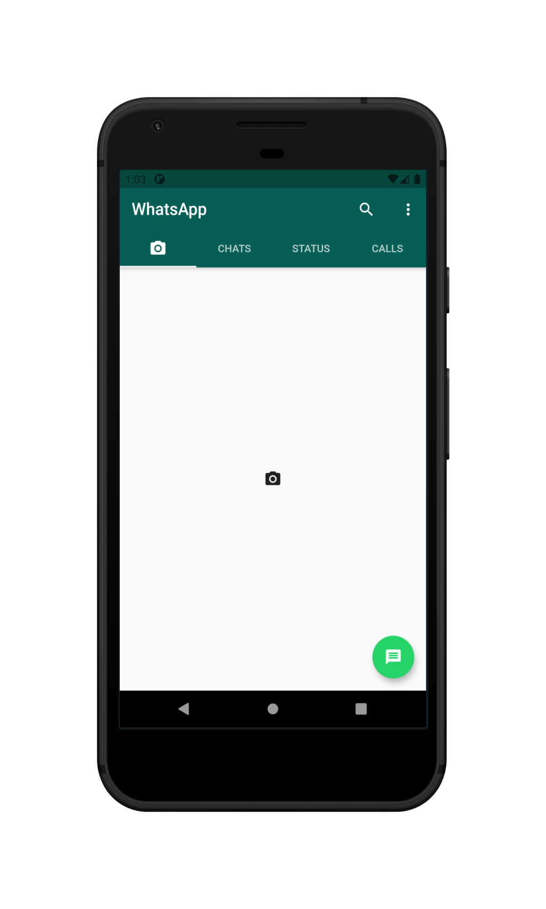
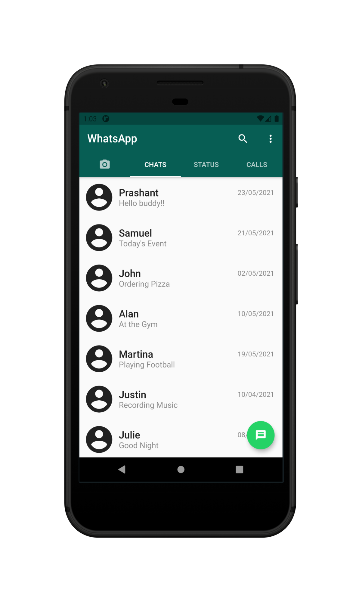

# Screenshots of the App

  <figure>
    
    <figcation style="text-align: left;">Camera Screen</figcaption>
  
    
    <figcation>Chats Screen</figcaption>
  </figure>

  <figure>
    
    <figcation>Status Screen</figcaption>
  </figure>
  
  <figure>
    
    <figcation>Calls Screen</figcaption>
  </figure>

